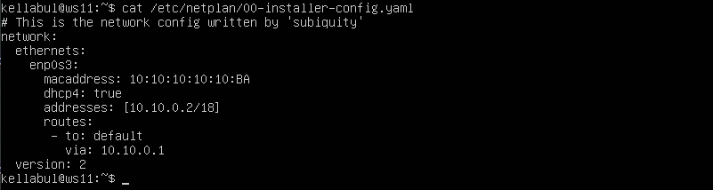
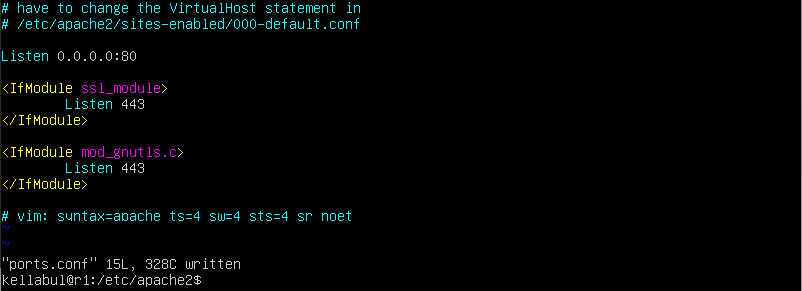
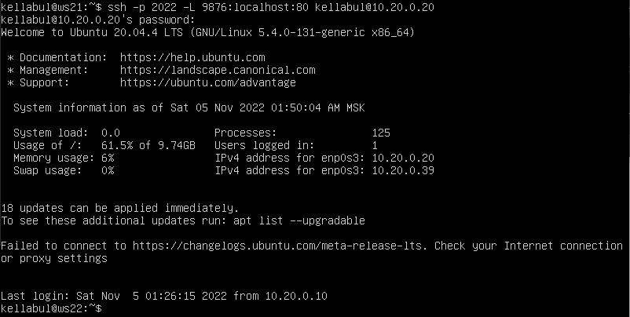

<style>
  img {
  border: 2px groove #21788a;
  }
</style>

Содержание:

- [Part 1. Инструмент ipcalc](#part-1-инструмент-ipcalc)
    - [1.1. Сети и маски](#11-сети-и-маски)
    - [1.2. localhost](#12-localhost)
    - [1.3. Диапазоны и сегменты сетей](#13-диапазоны-и-сегменты-сетей)
- [Part 2. Статическая маршрутизация между двумя машинами](#part-2-статическая-маршрутизация-между-двумя-машинами)
    - [2.1. Добавление статического маршрута вручную](#21-добавление-статического-маршрута-вручную)
    - [2.2. Добавление статического маршрута с сохранением](#22-добавление-статического-маршрута-с-сохранением)
- [Part 3. Утилита iperf3](#part-3-утилита-iperf3)
    - [3.1. Скорость соединения](#31-скорость-соединения)
    - [3.2. Утилита iperf3](#32-утилита-iperf3)
- [Part 4. Сетевой экран](#part-4-сетевой-экран)
    - [4.1. Утилита iptables](#41-утилита-iptables)
    - [4.2. Утилита nmap](#42-утилита-nmap)
- [Part 5. Статическая маршрутизация сети](#part-5-статическая-маршрутизация-сети)
    - [5.1. Настройка адресов машин](#51-настройка-адресов-машин)
    - [5.2. Включение переадресации IP-адресов](#52-включение-переадресации-ip-адресов)
    - [5.3. Установка маршрута по-умолчанию](#53-установка-маршрута-по-умолчанию)
    - [5.4. Добавление статических маршрутов](#54-добавление-статических-маршрутов)
    - [5.5. Построение списка маршрутизаторов](#55-построение-списка-маршрутизаторов)
    - [5.6. Использование протокола ICMP при маршрутизаци](#56-использование-протокола-icmp-при-маршрутизации)
- [Part 6. Динамическая настройка IP с помощью DHCP](#part-6-динамическая-настройка-ip-с-помощью-dhcp)
- [Part 7. NAT](#part-7-nat)
- [Part 8. Знакомство с SSH Tunnels.](#part-8-дополнительно-знакомство-с-ssh-tunnels)


## Part 1. Инструмент **ipcalc**

### 1.1. Сети и маски
>##### Определить и записать в отчёт:
>##### 1) Адрес сети *192.167.38.54/13*:
NETWORK: *192.167.38.54/13*\
ADDRESS: 192.167.38.54 \
BINARY: 11000000.10100111.00100110.00110110

>##### 2) Перевод маски *255.255.255.0* в префиксную и двоичную запись:
NETMASK: *255.255.255.0* \
BITMASK: /24 \
BINARY: 11111111.11111111.11111111.00000000

>##### Перевод маски */15* в обычную и двоичную,
BITMASK: */15* \
NETMASK: 255.254.0.0 \
BINARY: 11111111.11111110.00000000.00000000

>##### Перевод маски *11111111.11111111.11111111.11110000* в обычную и префиксную
BINARY: *11111111.11111111.11111111.11110000* \
NETMASK: 255.255.255.240 \
BITMASK: /28

>##### 3) Минимальный и максимальный хост в сети *12.167.38.4* при масках: */8*, *11111111.11111111.00000000.00000000*, *255.255.254.0* и */4*

| SUBNET MASK | HostMin | HostMax |
| ------ | ------ | ------ | 
| /8 | 12.0.0.1 | 12.255.255.254 |
| 11111111.11111111.00000000.00000000 | 12.167.0.1 | 12.167.255.254 |
| 255.255.254.0 | 12.167.38.1 | 12.167.39.254 |
| /4 | 0.0.0.1 | 15.255.255.254 | 

### 1.2. localhost
>##### Определить и записать в отчёт, можно ли обратиться к приложению, работающему на localhost, со следующими IP: *194.34.23.100*, *127.0.0.2*, *127.1.0.1*, *128.0.0.1*
***localhost*** (так называемый, «местный» от англ. local, или «локальный хост», по смыслу — этот компьютер) - зарезервированное доменное имя для частных IP-адресов (в диапазоне 127.0.0.1 — 127.255.255.254, RFC 2606).
Интерфейсы, для которых выделен этот диапазон, называются ***петлевыми*** и используются для обмена данными между процессами на одном компьютере или управляемом сетевом устройстве. Cоответственно, при IP, имеющим значения:\
*127.0.0.2*, *127.1.0.1* - можно обратиться\
*194.34.23.100*,  *128.0.0.1* - обратиться нельзя

### 1.3. Диапазоны и сегменты сетей
>##### Определить и записать в отчёт:
>##### 1) какие из перечисленных IP можно использовать в качестве публичного, а какие только в качестве частных: *10.0.0.45*, *134.43.0.2*, *192.168.4.2*, *172.20.250.4*, *172.0.2.1*, *192.172.0.1*, *172.68.0.2*, *172.16.255.255*, *10.10.10.10*, *192.169.168.1*

| IP | КЛАССИФИКАЦИЯ | 
| ------ | ------ |  
|10.0.0.45| PRIVATE |
|134.43.0.2| PUBLIC |
|192.168.4.2| PRIVATE |
|172.20.250.4| PRIVATE |
|172.0.2.1| PUBLIC |
|192.172.0.1| PUBLIC |
|172.68.0.2| PUBLIC |
|172.16.255.255| PRIVATE|
|10.10.10.10|PRIVATE|
|192.169.168.1| PUBLIC|

>##### 2) какие из перечисленных IP адресов шлюза возможны у сети *10.10.0.0/18*: *10.0.0.1*, *10.10.0.2*, *10.10.10.10*, *10.10.100.1*, *10.10.1.255*
Задача  шлюза - обеспечивать взаимодействие с другими сетями. Все соединения, устанавливаемые из данной сети с какой-либо иной и наоборот, осуществляются через этот шлюзовой компьютер. Таким образом, адрес шлюза сети должен находиться в диапазоне, между HostMin и HostMax.
Для сети *10.10.0.0/18* \
HostMin = 10.10.0.1 \
HostMax = 10.10.63.254 \
Возможные IP адреса шлюза (из перечисленных): 10.10.0.2, 10.10.10.10, 10.10.1.255

## Part 2. Статическая маршрутизация между двумя машинами

>##### С помощью команды `ip a` посмотреть существующие сетевые интерфейсы


>##### Описать сетевой интерфейс, соответствующий внутренней сети, на обеих машинах и задать следующие адреса и маски: ws1 - *192.168.100.10*, маска */16*, ws2 - *172.24.116.8*, маска */12*

Сетевой интерфейс, использующийся для внутренней сети - ethernet. Имя сетевого интерфейса - `enp0s3`, где  `p0s3` — физичес­кое рас­положе­ние устрой­ства на шине PCI.\
Задаем машине ws1 адреса *192.168.100.10* и маску */16*


Задаем машине ws2 адреса *172.24.116.8* и маску */12*


>##### Выполнить команду `netplan apply` для перезапуска сервиса сети


### 2.1. Добавление статического маршрута вручную
>##### Добавить статический маршрут от одной машины до другой и обратно при помощи команды вида `ip r add`
>##### Пропинговать соединение между машинами


### 2.2. Добавление статического маршрута с сохранением
>##### Перезапустить машины
>##### Добавить статический маршрут от одной машины до другой с помощью файла *etc/netplan/00-installer-config.yaml*


>##### Пропинговать соединение между машинами


## Part 3. Утилита **iperf3**

### 3.1. Скорость соединения
>##### Перевести и записать в отчёт: 8 Mbps в MB/s, 100 MB/s в Kbps, 1 Gbps в Mbps
8 Mbps = 1 MB/s\
100 MB/s = 819200 kbps\
1 Gbps = 1024 Mbps

### 3.2. Утилита **iperf3**
>##### Измерить скорость соединения между ws1 и ws2
Запуск серверную часть на машине ws1:


Обращаемся к серверной части, доступной по IP *192.168.100.10*, с машины ws2:


## Part 4. Сетевой экран
### 4.1. Утилита **iptables**
>##### Создать файл */etc/firewall.sh*, имитирующий фаерволл, на ws1 и ws2:
```shell
#!/bin/sh

# Удаление всех правил в таблице "filter" (по-умолчанию).
iptables –F
iptables -X
```
>##### Нужно добавить в файл подряд следующие правила:
>##### 1) на ws1 применить стратегию когда в начале пишется запрещающее правило, а в конце пишется разрешающее правило (это касается пунктов 4 и 5)
>##### 2) на ws2 применить стратегию когда в начале пишется разрешающее правило, а в конце пишется запрещающее правило (это касается пунктов 4 и 5)
>##### 3) открыть на машинах доступ для порта 22 (ssh) и порта 80 (http)
>##### 4) запретить *echo reply* (машина не должна "пинговаться”, т.е. должна быть блокировка на OUTPUT)
>##### 5) разрешить *echo reply* (машина должна "пинговаться")
>##### Запустить файлы на обеих машинах командами `chmod +x /etc/firewall.sh` и `/etc/firewall.sh`


- В отчёт поместить скрины с запуском обоих файлов.
- В отчёте описать разницу между стратегиями, применёнными в первом и втором файлах.

В первом случае (когда в начале пишется запрещающее правило, а в конце пишется разрешающее правило), машина принимает пакеты, но не отправляет.
Во втором случае (когда в начале пишется разрешающее правило, а в конце пишется запрещающее правило), машина и принимает и отправляет пакеты.


Из этого можно сделать вывод, что iptables применяет первое правило, и игнорирует последующие.

### 4.2. Утилита **nmap**
>##### Командой **ping** найти машину, которая не "пингуется", после чего утилитой **nmap** показать, что хост машины запущен
*Проверка: в выводе nmap должно быть сказано: `Host is up`*


## Part 5. Статическая маршрутизация сети

Сеть: \


>##### Поднять пять виртуальных машин (3 рабочие станции (ws11, ws21, ws22) и 2 роутера (r1, r2))

### 5.1. Настройка адресов машин
>##### Настроить конфигурации машин в *etc/netplan/00-installer-config.yaml* согласно сети на рисунке.
Рабочая станция ws11


Рабочая станция ws21


Рабочая станция ws22


Роутер r1


Роутер r2


>##### Перезапустить сервис сети. Если ошибок нет, то командой `ip -4 a` проверить, что адрес машины задан верно. Также пропинговать ws22 с ws21. Аналогично пропинговать r1 с ws11.


### 5.2. Включение переадресации IP-адресов.
>##### Для включения переадресации IP, выполните команду на роутерах:
`sysctl -w net.ipv4.ip_forward=1`
*При таком подходе переадресация не будет работать после перезагрузки системы.*


>##### Откройте файл */etc/sysctl.conf* и добавьте в него следующую строку:
`net.ipv4.ip_forward = 1`
*При использовании этого подхода, IP-переадресация включена на постоянной основе.*


### 5.3. Установка маршрута по-умолчанию
Пример вывода команды `ip r` после добавления шлюза:
```
default via 10.10.0.1 dev eth0
10.10.0.0/18 dev eth0 proto kernel scope link src 10.10.0.2
```
>##### Настроить маршрут по-умолчанию (шлюз) для рабочих станций. Для этого добавить `default` перед IP роутера в файле конфигураций
>##### Вызвать `ip r` и показать, что добавился маршрут в таблицу маршрутизации


>##### Пропинговать с ws11 роутер r2 и показать на r2, что пинг доходит. Для этого использовать команду:
`tcpdump -tn -i eth1`


### 5.4. Добавление статических маршрутов
>##### Добавить в роутеры r1 и r2 статические маршруты в файле конфигураций. Пример для r1 маршрута в сетку 10.20.0.0/26:
```shell
# Добавить в конец описания сетевого интерфейса eth1:
- to: 10.20.0.0
  via: 10.100.0.12
```
>##### Вызвать `ip r` и показать таблицы с маршрутами на обоих роутерах. Пример таблицы на r1:
```
10.100.0.0/16 dev eth1 proto kernel scope link src 10.100.0.11
10.20.0.0/26 via 10.100.0.12 dev eth1
10.10.0.0/18 dev eth0 proto kernel scope link src 10.10.0.1
```


>##### Запустить команды на ws11:
`ip r list 10.10.0.0/[маска сети]` и `ip r list 0.0.0.0/0`


- В отчёте объяснить, почему для адреса 10.10.0.0/\[маска сети\] был выбран маршрут, отличный от 0.0.0.0/0, хотя он попадает под маршрут по-умолчанию.

Маршрут по умолчанию используется, когда нужно обратиться к хосту, который находится в сети, отличной от домашней сети хоста-отправителя, либо если в таблице маршрутизации не найден нужный маршрут. 
Сеть 10.10.0.0/18 является домашней для хоста ws11, поэтому в данном случае использование маршрута по умолчанию не требуется.

### 5.5. Построение списка маршрутизаторов
Пример вывода утилиты **traceroute** после добавления шлюза:
```
1 10.10.0.1 0 ms 1 ms 0 ms
2 10.100.0.12 1 ms 0 ms 1 ms
3 10.20.0.10 12 ms 1 ms 3 ms
```
>##### Запустить на r1 команду дампа:
`tcpdump -tnv -i eth0`
>##### При помощи утилиты **traceroute** построить список маршрутизаторов на пути от ws11 до ws21


- В отчёте, опираясь на вывод, полученный из дампа на r1, объяснить принцип работы построения пути при помощи **traceroute**.

Из вывода дампа на r1, мы видим, что *traceroute* посылает множество пакетов используя протокол UDP, тем самым определяя количество хопов, через которые пакет должен пройти, чтобы добраться до конечного хоста. Для учета этого количества утилита использует поле TTL (Time To Live), которое находится в заголовке IP-пакета и которое определяет время жизни пакета. Если на пути к удалённому адресату время жизни пакета становится равно 0, маршрутизатор отбросывает пакет и отправляет источнику ICMP-сообщение об ошибке «Time Exceeded» (время истекло).

### 5.6. Использование протокола **ICMP** при маршрутизации
>##### Запустить на r1 перехват сетевого трафика, проходящего через eth0 с помощью команды:
`tcpdump -n -i eth0 icmp`
>##### Пропинговать с ws11 несуществующий IP (например, *10.30.0.111*) с помощью команды:
`ping -c 1 10.30.0.111`


## Part 6. Динамическая настройка IP с помощью **DHCP**
>##### Для r2 настроить в файле */etc/dhcp/dhcpd.conf* конфигурацию службы **DHCP**:
Устанавливаем dhcp сервер на r2:
```shell
sudo apt install isc-dhcp-server
```
>##### 1) указать адрес маршрутизатора по-умолчанию, DNS-сервер и адрес внутренней сети. Пример файла для r2:
```shell
subnet 10.100.0.0 netmask 255.255.0.0 {}

subnet 10.20.0.0 netmask 255.255.255.192
{
    range 10.20.0.2 10.20.0.50;
    option routers 10.20.0.1;
    option domain-name-servers 10.20.0.1;
}
```
>##### 2) в файле *resolv.conf* прописать `nameserver 8.8.8.8.`


>##### Перезагрузить службу **DHCP** командой `systemctl restart isc-dhcp-server`. Машину ws21 перезагрузить при помощи `reboot` и через `ip a` показать, что она получила адрес. Также пропинговать ws22 с ws21.


Дополнительно пропингуем w21 с w22:


>##### Указать MAC адрес у ws11, для этого в *etc/netplan/00-installer-config.yaml* надо добавить строки: `macaddress: 10:10:10:10:10:BA`, `dhcp4: true`



Дополнительно необходимо прописать MAC адрес в настройках сети виртуальной машины ws11 в VirtuaBox.

>##### Для r1 настроить аналогично r2, но сделать выдачу адресов с жесткой привязкой к MAC-адресу (ws11). Провести аналогичные тесты


Перезагружаем ws11 и пингуем ws22:


Дополнительно пингуем ws11 с w22:


>##### Запросить с ws21 обновление ip адреса


Сначала освобождаем ip-адрес командой `dhclient -r`, а затем запрашиваем новый той же командой, но без аргументов (на данном устройстве у нас только один сетевой интерфейс, поэтому указывать его дополнительно в качестве аргумента к команде не требуется).

## Part 7. **NAT**
>##### В файле */etc/apache2/ports.conf* на ws22 и r1 изменить строку `Listen 80` на `Listen 0.0.0.0:80`, то есть сделать сервер Apache2 общедоступным




>##### Запустить веб-сервер Apache командой `service apache2 start` на ws22 и r1


>##### Добавить в фаервол, созданный по аналогии с фаерволом из Части 4, на r2 следующие правила:
>##### 1) Удаление правил в таблице filter - `iptables -F`
>##### 2) Удаление правил в таблице "NAT" - `iptables -F -t nat`
>##### 3) Отбрасывать все маршрутизируемые пакеты - `iptables --policy FORWARD DROP`
>##### Запускать файл также, как в Части 4
>##### Проверить соединение между ws22 и r1 командой `ping`


*При запуске файла с этими правилами, ws22 не должна "пинговаться" с r1*


>##### Добавить в файл ещё одно правило:
>##### 4) Разрешить маршрутизацию всех пакетов протокола **ICMP**

```console
iptables -A FORWARD -p icmp -j ACCEPT
```
>##### Проверить соединение между ws22 и r1 командой `ping`
*При запуске файла с этими правилами, ws22 должна "пинговаться" с r1*


>##### Добавить в файл ещё два правила:
>##### 5) Включить **SNAT**, а именно маскирование всех локальных ip из локальной сети, находящейся за r2 (по обозначениям из Части 5 - сеть 10.20.0.0)
>##### 6) Включить **DNAT** на 8080 порт машины r2 и добавить к веб-серверу Apache, запущенному на ws22, доступ извне сети

[Руководство по iptables](https://www.opennet.ru/docs/RUS/iptables/#SNATTARGET)


>##### Запускать файл также, как в Части 4
>##### Проверить соединение по TCP для **SNAT**, для этого с ws22 подключиться к серверу Apache на r1 командой:
`telnet [адрес] [порт]`


>##### Проверить соединение по TCP для **DNAT**, для этого с r1 подключиться к серверу Apache на ws22 командой `telnet` (обращаться по адресу r2 и порту 8080)


## Part 8. Дополнительно. Знакомство с **SSH Tunnels**
>##### Запустить на r2 фаервол с правилами из Части 7


>##### Запустить веб-сервер **Apache** на ws22 только на localhost (то есть в файле */etc/apache2/ports.conf* изменить строку `Listen 80` на `Listen localhost:80`)


>##### Воспользоваться *Local TCP forwarding* с ws21 до ws22, чтобы получить доступ к веб-серверу на ws22 с ws21




>##### Воспользоваться *Remote TCP forwarding* c ws11 до ws22, чтобы получить доступ к веб-серверу на ws22 с ws11


>##### Сохранить дампы образов виртуальных машин

\


